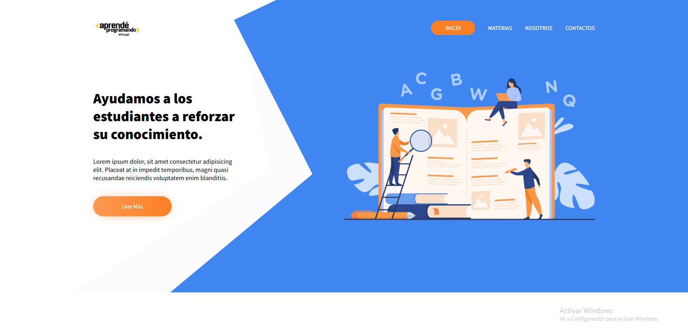

# 📒APRENDE PROGRAMANDO DW1
  

Proyecto final de desarrollo web1 en aprende programando. Su objetivo es almacenar contenido educativo, para que cualquiera pueda usarlo.
https://valentinzoia.github.io/education.github.io/education1/index/ . El proyecto es más que nada la idea y el objetivo final de el alamcenamiento de contenido educativo gratuito. 
La pagina solo se puedo hacer el header de la landing.

